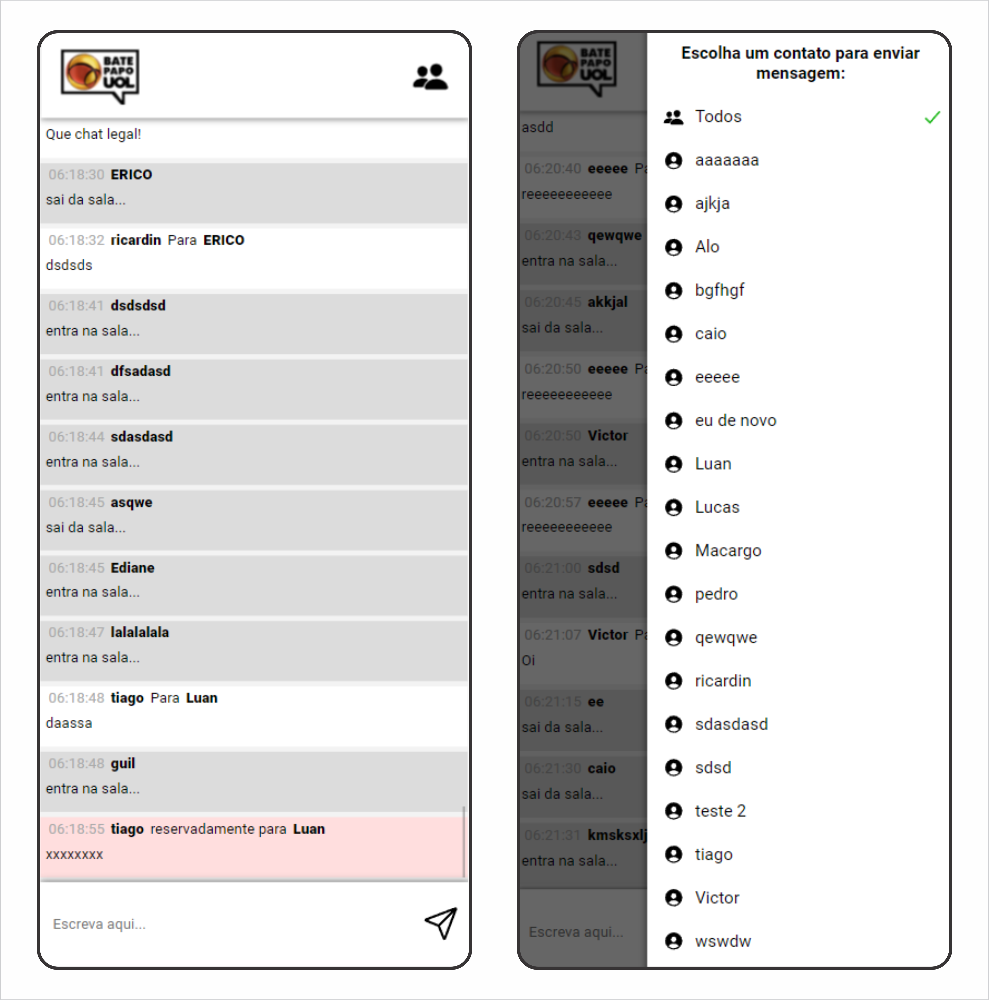

# <p align = "center">Web mobile online chat (UOL inspired)</p>

<p align = "center"></p>

## ✏️ Description
<p align="justify" >This project was done in the fifth week of the Full Stack Driven course. An average of 20 hours were put into the website, the main goals were to train http requisitions using the axios framework. The website is not responsive to larger screens, it is intended to work only on cellphones, since the main goal was to train JavaScript logic. I recommend using the Iphone XR or SE setup.</p>

##  <p align = "left"> :white_circle: Technologies</p>

- [JavaScript](https://www.javascript.com/)
- [HTML5](https://html5.org/)
- [CSS3](https://www.w3.org/Style/CSS/)
- [Axios](https://axios-http.com/docs/intro)

# 🏁 Let's go!

First clone this github repository into your computer, then open the folder cloned:

```bash
https://github.com/ecocaval/projeto5-batepapouol.git
```
Open the index.html file in your default browser and enjoy the website!
